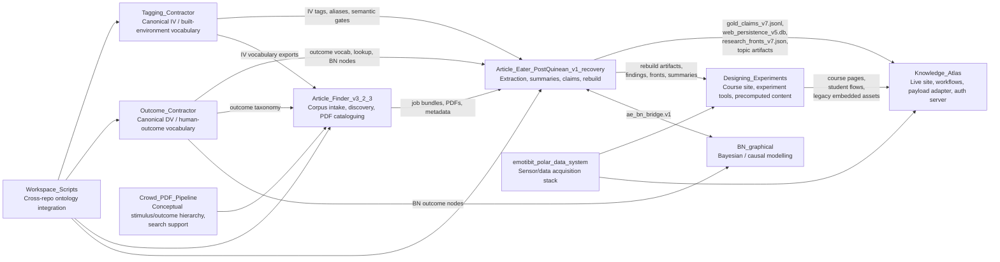

# ATLAS Multi-Repo System Boxology And Student Track Map

Date: 2026-04-05  
Author: Codex

## Why This Note Exists

The ATLAS system does not live in one repository. It is a federation of repos with distinct authorities:

- one repo is the live site
- one repo is the extraction and rebuild engine
- one repo is the intake and corpus manager
- two repos define the main semantic vocabularies
- one repo is the course and experiment-design layer
- one repo is the causal-modeling layer

If one does not say this plainly, people edit the wrong thing.

## Executive Summary

If you ask which repos matter most, the answer depends on the task.

- For the live website and student-facing system: `Knowledge_Atlas`
- For the extraction truth, rebuilds, summaries, claims, topics, and research fronts: `Article_Eater_PostQuinean_v1_recovery`
- For finding and organizing papers before extraction: `Article_Finder_v3_2_3`
- For built-environment IV semantics: `Tagging_Contractor`
- For human-outcome DV semantics: `Outcome_Contractor`
- For course materials, experiment-design teaching, and some legacy frontend surfaces: `Designing_Experiments`
- For Bayesian and causal graphical modeling: `BN_graphical`

So there is no single main repo. There is, instead, a division of labour.

## Core Boxology

## System Layers

The system is best understood in six layers.

1. `Intake`
   Papers are found, deduplicated, classified, and packed for extraction.

2. `Semantic Authority`
   Built-environment tags and human-outcome tags are defined and exported.

3. `Extraction And Rebuild`
   PDFs become text, page images, cropped figures, science summaries, claims, rebuild DBs, topic ontologies, and research fronts.

4. `Site Payload Adaptation`
   Rebuild outputs are transformed into compact JSON payloads for the website.

5. `Presentation And Workflow`
   Users encounter role-based pages, evidence browsers, topic maps, contributor flows, and course pages.

6. `Advanced Modelling And Experimental Design`
   Bayesian causal models, experiment wizards, sensor stacks, and neuroscience-grounded extensions sit here.

## Repo By Repo

### 1. `Knowledge_Atlas`

**Role**

This is the canonical GUI and website repo. It owns the live HTML, JS, CSS, navigation, user workflows, auth server, contributor interfaces, and the payload lane used by the website.

**Main Interactions**

- Reads canonical rebuild outputs from `Article_Eater_PostQuinean_v1_recovery`
- Embeds or links course and experiment-design surfaces from `Designing_Experiments`
- Presents material to students, contributors, researchers, practitioners, and instructors

**Major Pipelines**

1. `KA payload adapter`
   - Script: `scripts/build_ka_adapter_payloads.py`
   - Reads:
     - `web_persistence_v5.db`
     - `gold_claims_v7.jsonl`
     - `research_fronts_v7.json`
     - `topic_ontology_v1.json`
     - `topic_memberships_v1.json`
     - extraction registry and related AE artifacts
   - Writes:
     - `data/ka_payloads/articles.json`
     - `data/ka_payloads/evidence.json`
     - `data/ka_payloads/topics.json`
     - `data/ka_payloads/topic_hierarchy.json`
     - `data/ka_payloads/research_fronts.json`
     - related public payloads

2. `Live site serving`
   - Static HTML/JS pages plus `ka_auth_server.py`
   - Serves the site, intake pages, and workflow pages

3. `Workflow / role presentation`
   - Pages such as `ka_user_home.html`, `ka_workflow_hub.html`, and route CTA logic
   - Creates role-specific inquiry paths

**Important Contracts**

- Operationally depends on the AE rebuild/export contracts
- Governed locally by:
  - `ADMIN_Readme_Server_Installation.md`
  - workflow and page manifests in `docs/`
- In practice, its strongest interface contract is the structure expected by `build_ka_adapter_payloads.py`

**What Students Could Do Here**

- UI design and usability
- onboarding flows
- contributor flows
- role-based pedagogy
- evidence browsing
- topic-map intelligibility
- assignment and course surfaces

**Who Should Mostly Work Here**

- GUI students
- usability students
- workflow and pedagogy students
- course-site maintainers

### 2. `Article_Eater_PostQuinean_v1_recovery`

**Role**

This is the canonical extraction and rebuild engine. It is the semantic and evidential heart of the system.

**Main Interactions**

- Ingests jobs and papers from `Article_Finder_v3_2_3`
- Uses vocabulary authority from `Tagging_Contractor` and `Outcome_Contractor`
- Produces the claims, rebuild DB, research fronts, topic artifacts, and summary surfaces consumed by `Knowledge_Atlas`
- Supplies content and findings to `Designing_Experiments`
- Exchanges bridge formats with `BN_graphical`

**Major Pipelines**

1. `End-to-end PDF extraction pipeline`
   Defined in `contracts/END_TO_END_PIPELINE_CONTRACT_2026-04-06.md`
   Stages:
   - PDF ingestion
   - structured extraction
   - page image rendering
   - figure/table/image cropping
   - gold science-writer summary generation
   - integration JSON assembly
   - PNU generation
   - article display page assembly
   - database registration and tier classification

2. `Canonical export and rebuild`
   - `scripts/export_v7_accepted_claims.py`
   - `scripts/run_v7_canonical_rebuild.py`
   - `scripts/rebuild_all.sh`
   Produces:
   - `data/rebuild/gold_claims_v7.jsonl`
   - `data/rebuild/web_persistence_v5.db`
   - `data/rebuild/research_fronts_v7.json`
   - topic ontology and topic membership artifacts

3. `Topic ontology and research-front generation`
   Produces:
   - `topic_ontology_v1.json`
   - `topic_memberships_v1.json`
   - `research_fronts_v7.json`

4. `Science-summary and cropped visual lane`
   Produces:
   - `codex_local_gold_outputs`
   - `codex_local_gold_outputs_cropped`
   - extraction registry alignment

**Important Contracts**

This repo is contract-heavy. The most important current ones are:

- `END_TO_END_PIPELINE_CONTRACT_2026-04-06.md`
- `CODEX_LOCAL_GOLD_CONTRACT_2026-03-28.md`
- `TOPIC_ONTOLOGY_AND_RESEARCH_FRONT_CONTRACT_2026-03-30.md`
- `V7_CANONICAL_REBUILD_EXPORT_CONTRACT_2026-03-29.md`
- `V7_CANONICAL_REBUILD_OPERATION_CONTRACT_2026-03-29.md`
- `V7_EXTRACTION_REGISTRY_CONTRACT_2026-03-29.md`
- `V7_GOLD_EXTRACTION_PIPELINE_AUTHORITY_2026-03-29.md`
- cross-repo contracts under `contracts/cross_repo/`

**Cross-Repo Contract Interfaces**

- `ae_bundle.v1`
- `ae.claim.v2`
- `ae.rule.v2`
- `ae_bn_bridge.v1`
- `oc.export.v1`

**What Students Could Do Here**

- extraction QA
- claim normalization
- topic mapping
- research-front logic
- summary quality
- visual cropping QA
- ontology integration
- evidence and contradiction mining

**Who Should Mostly Work Here**

- advanced backend students
- ontology students
- evidence-extraction students
- theory/mechanism students

### 3. `Article_Finder_v3_2_3`

**Role**

This is the intake and literature-discovery engine. It is where papers are found, imported, deduplicated, enriched, and queued for AE.

**Main Interactions**

- Receives source material from spreadsheets, PDFs, DOI searches, Zotero, and search tools
- Exports job bundles to `Article_Eater_PostQuinean_v1_recovery`
- Consumes semantic vocabulary from `Tagging_Contractor` and `Outcome_Contractor`

**Major Pipelines**

1. `Import and enrichment pipeline`
   - import
   - PDF matching
   - DOI resolution
   - metadata enrichment

2. `Discovery / expansion pipeline`
   - bounded expansion
   - discovery orchestration
   - classification

3. `AE job-bundle pipeline`
   - Command: `python cli/main.py build-jobs`
   - Produces Article Eater job bundles

**Important Contracts**

- `af.job_bundle.v1`
- participates in `ae_bundle.v1`
- imports `oc.export.v1` style exports and TC-derived vocab integrations

**What Students Could Do Here**

- literature search tooling
- PDF intake
- citation hygiene
- deduplication
- corpus expansion
- job-bundle preparation

**Who Should Mostly Work Here**

- intake/discovery students
- bibliography and search students
- data curation students

### 4. `Tagging_Contractor`

**Role**

This is the canonical built-environment vocabulary authority. It chiefly governs the IV side of the system.

**Main Interactions**

- Exports environmental tag vocabularies and aliases to AE and AF
- Informs topic and query design
- Provides semantic gates and audits

**Major Pipelines**

1. `Tag authority and registry pipeline`
   - Canonical registry under `core/trs-core/.../registry_v0.2.8.json`

2. `Audit and production gates`
   - `./bin/tc audit-tags`
   - `./bin/tc audit-semantics`
   - `./bin/tc doctor --prod`

3. `Phase-bundle exports`
   - image-only
   - image plus depth / 3D
   - computed
   - metadata
   - sensor-required

**Important Contracts**

- The repo functions less as a schema exchange repo and more as an authority registry plus audit gate
- In practice, its contract is the exported tag registry and the enforced semantics gates

**What Students Could Do Here**

- image-tag semantics
- built-environment category design
- alias design
- audit and tagging usability
- operationalization of visual conditions

**Who Should Mostly Work Here**

- image-tagging students
- semantic taxonomy students
- vision-to-semantics students

### 5. `Outcome_Contractor`

**Role**

This is the canonical human-outcome vocabulary authority. It chiefly governs the DV side of the system.

**Main Interactions**

- Exports canonical outcome vocabularies to AE, AF, and BN
- Serves as the effect-side vocabulary authority

**Major Pipelines**

1. `Canonical outcome export pipeline`
   Produces:
   - `contracts/oc_export/outcome_vocab.json`
   - `contracts/oc_export/constitutive_bridges.json`
   - `contracts/oc_export/ae_outcome_lookup.json`
   - `contracts/oc_export/af_outcomes_taxonomy.yaml`
   - `contracts/oc_export/bn_outcome_nodes.json`

2. `BN node export`
   - Produces BN-compatible outcome nodes

3. `Canonical vocabulary maintenance`
   - keeps cognitive, affective, behavioural, social, physiological, neural, and health terms coherent

**Important Contracts**

- `oc.export.v1`
- `oc.bn_nodes.v1`
- `oc.ae_lookup.v1`

**What Students Could Do Here**

- outcome normalization
- DV hierarchy design
- operationalization mapping
- constitutive bridge design
- neuroscience grounding vocabulary

**Who Should Mostly Work Here**

- outcome-taxonomy students
- mechanism students
- neuroscience-grounding students

### 6. `Designing_Experiments`

**Role**

This is the course, experiment-design, and precomputed-content repo. It has some live surfaces, some course materials, and some legacy frontend assets.

**Main Interactions**

- Reads AE rebuild artifacts to generate precomputed teaching content
- Supplies course pages and experiment tools to the broader KA ecosystem

**Major Pipelines**

1. `Precomputed content rebuild pipeline`
   - Script: `scripts/rebuild_precomputed_content.py`
   Regenerates or flags:
   - research-front statistics
   - DOI registry enrichment
   - V5 design fields
   - BN cross-reference mapping
   - front display names
   - several agent-generated content surfaces

2. `Course and experiment-tool surface generation`
   - experiment wizard
   - knowledge navigator
   - theory-and-experiment pages
   - course pilot and track pages

3. `Content staleness / rebuild manifest logic`
   - content regeneration based on changed source fingerprints

**Important Contracts**

- Less schema-centric than AE
- Important governing docs include:
  - `docs/CONTENT_CREATION_SPEC_2026-03-13.md`
  - rebuild-manifest logic and source-fingerprint expectations

**What Students Could Do Here**

- course materials
- experiment-design tools
- hypothesis builders
- theory-to-experiment teaching aids
- track-specific pedagogical content

**Who Should Mostly Work Here**

- pedagogy students
- experimental-design students
- course-site students

### 7. `BN_graphical`

**Role**

This is the Bayesian and causal-graph modeling repo.

**Main Interactions**

- Consumes AE claims/rules and OC outcome nodes
- Exchanges bridge formats with AE
- Supports explicit causal structure and interventional reasoning

**Major Pipelines**

1. `Causal graph / bridge pipeline`
   - maps AE outputs into BN-compatible forms

2. `Epistemic coherence pipeline`
   - adapter logic for uncertainty, credence, and bridge interpretation

3. `Graphical frontend and model interaction`
   - advanced causal inspection and explanation

**Important Contracts**

- `ae_bn_bridge.v1`
- local bridge schema: `contracts/ae_bn_bridge.v1.schema.json`

**What Students Could Do Here**

- causal modelling
- uncertainty modelling
- interventional query design
- theory-graph representation

**Who Should Mostly Work Here**

- advanced modelling students
- mathematically stronger research students

## Important Supporting Repos

### `Workspace_Scripts`

This contains useful cross-repo glue. The most important example is the ontology integrator that treats:

- `Tagging_Contractor` as IV authority
- `Outcome_Contractor` as DV authority
- `Article_Finder` as corpus manager
- `Article_Eater` as extraction consumer and producer

Students usually should not begin here, but advanced maintainers may need it.

### `Crowd_PDF_Pipeline`

This is useful as a conceptual and planning support repo. It contains important hierarchy and search-design material, including built-environment stimuli and outcomes hierarchies. It is more of a reference and scaffolding layer than a central runtime repo.

### `emotibit_polar_data_system`

This is a separate data-acquisition and physiological-system repo. It is relevant if the course wants to move from literature and ontology into actual measurement and sensor integration.

## Deprecated Or Secondary Repos

- `Article_Eater_PostQuinean_v1`
  Deprecated. Do not use as the active extraction authority.

- `AE_clean_push`
  Temporary worktree, not a canonical system repo.

- `Backups`, `Older Repos etc`, `_Collecting Articles`, `__Zotero whole bibliography`
  Useful operationally, but not the main live architecture.

## The Main Pipelines Across Repos

### Pipeline A: Corpus Intake To Extraction

1. `Article_Finder_v3_2_3`
   - imports papers
   - enriches metadata
   - matches PDFs
   - creates job bundles

2. `Article_Eater_PostQuinean_v1_recovery`
   - ingests jobs and PDFs
   - extracts text, evidence, claims, summaries, and visuals

**Makes**

- job bundles
- accepted extraction records
- gold claims
- summaries

### Pipeline B: Semantic Authority Injection

1. `Tagging_Contractor`
   - provides IV vocabulary

2. `Outcome_Contractor`
   - provides DV vocabulary

3. `Workspace_Scripts`
   - helps integrate those vocabularies into AF and AE

**Makes**

- environment vocabularies
- outcome vocabularies
- lookups and bridge files

### Pipeline C: Canonical Rebuild To Site Payloads

1. `Article_Eater_PostQuinean_v1_recovery`
   - runs canonical rebuild
   - produces rebuild DB, claims, fronts, topics

2. `Knowledge_Atlas`
   - runs payload adapter
   - writes site-ready JSON

3. `Knowledge_Atlas`
   - serves the site from those payloads

**Makes**

- `web_persistence_v5.db`
- `gold_claims_v7.jsonl`
- `research_fronts_v7.json`
- `topic_ontology_v1.json`
- `topic_memberships_v1.json`
- public KA payload JSONs

### Pipeline D: Rebuild To Course Content

1. `Article_Eater_PostQuinean_v1_recovery`
   - provides rebuild and summary artifacts

2. `Designing_Experiments`
   - runs `rebuild_precomputed_content.py`
   - regenerates front stats, display names, design fields, and related content

**Makes**

- precomputed teaching content
- course-side explanation surfaces
- experiment-design materials

### Pipeline E: Evidence To Causal Modelling

1. `Article_Eater_PostQuinean_v1_recovery`
   - supplies claims/rules

2. `Outcome_Contractor`
   - supplies outcome node vocabulary

3. `BN_graphical`
   - bridges the evidence into causal structures

**Makes**

- Bayesian node structures
- interventional reasoning surfaces
- epistemic bridge representations

## Which Repo Is The One You Need Most?

This depends entirely on the task.

### If the task is...

`Make the site work better`

Use:

- `Knowledge_Atlas`

`Fix extraction, summaries, claims, topics, or research fronts`

Use:

- `Article_Eater_PostQuinean_v1_recovery`

`Find more papers or curate the corpus`

Use:

- `Article_Finder_v3_2_3`

`Fix environmental tag semantics`

Use:

- `Tagging_Contractor`

`Fix outcome semantics or DV grouping`

Use:

- `Outcome_Contractor`

`Improve course pages or experiment-design teaching`

Use:

- `Designing_Experiments`

`Build causal models or uncertainty-aware inference`

Use:

- `BN_graphical`

## Is This Useful For Students?

Yes, provided the system is presented as a set of roles rather than as a heap of repos.

If students are simply shown a directory listing, it will confuse them. If instead they are shown:

- what problem each repo solves
- what goes in and what comes out
- what contracts govern it
- which student track is allowed to touch it

then the multi-repo system becomes pedagogically useful.

It becomes especially useful because different kinds of students can work on genuinely different layers without stepping on one another.

## Suggested Student Tracks

### Track 1: GUI And User Experience

Primary repo:

- `Knowledge_Atlas`

Possible tasks:

- workflow intelligibility
- evidence browsing
- topic map UX
- contributor intake UX
- route guidance and exports

### Track 2: Literature Intake And Corpus Curation

Primary repo:

- `Article_Finder_v3_2_3`

Secondary repos:

- `Knowledge_Atlas`
- `Article_Eater_PostQuinean_v1_recovery`

Possible tasks:

- PDF matching
- metadata cleanup
- expansion strategies
- intake dashboards

### Track 3: Image Tags And Built-Environment Semantics

Primary repo:

- `Tagging_Contractor`

Secondary repos:

- `Knowledge_Atlas`
- `Article_Eater_PostQuinean_v1_recovery`

Possible tasks:

- new IV tags
- alias audits
- tagging bundles
- visual condition mapping

### Track 4: Outcome Semantics And Neuroscientific Grounding

Primary repo:

- `Outcome_Contractor`

Secondary repos:

- `Article_Eater_PostQuinean_v1_recovery`
- `Designing_Experiments`

Possible tasks:

- DV hierarchy refinement
- stress/allostasis distinctions
- constitutive bridges
- neural and physiological operationalizations

### Track 5: Extraction And Evidence Engineering

Primary repo:

- `Article_Eater_PostQuinean_v1_recovery`

Possible tasks:

- extraction repair
- cropping QA
- summary quality
- contradiction detection
- topic memberships
- front overlays

### Track 6: Course Tools And Experimental Design

Primary repo:

- `Designing_Experiments`

Secondary repos:

- `Knowledge_Atlas`
- `BN_graphical`

Possible tasks:

- experiment wizard
- learning tools
- topic mini-reviews
- research-front teaching layers
- assignment builders

### Track 7: Causal Modelling And Formal Theory

Primary repo:

- `BN_graphical`

Secondary repos:

- `Article_Eater_PostQuinean_v1_recovery`
- `Outcome_Contractor`

Possible tasks:

- causal graph construction
- interventional queries
- bridge validation
- uncertainty displays

## Recommended Rule For Students

Each track should have:

- one primary repo
- at most two secondary repos
- an explicit list of files they may edit
- one supervising contract document

That is the simplest way to stop the system from becoming anarchy.

## Practical Recommendation

For teaching, I would introduce the system in this order:

1. `Knowledge_Atlas`
   The thing users see.

2. `Article_Eater_PostQuinean_v1_recovery`
   The thing that makes the site intelligent.

3. `Article_Finder_v3_2_3`
   The thing that feeds the system new papers.

4. `Tagging_Contractor` and `Outcome_Contractor`
   The two semantic authorities.

5. `Designing_Experiments`
   The pedagogical and experiment-design layer.

6. `BN_graphical`
   The advanced modelling layer.

That order is intellectually natural. It moves from visible surface to semantic machinery.

## Final Judgment

Yes, this is useful for students.

But only if you teach the repos as a constitution, not as a junk drawer.

The good pedagogical message is:

- one system
- several authorities
- explicit handoffs
- explicit contracts
- different tracks touch different layers

That is a proper architecture, and it is teachable.
