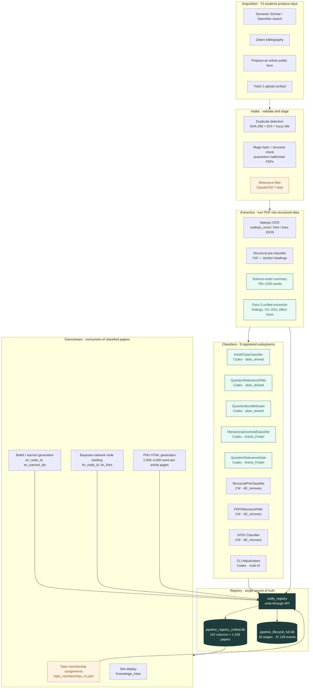

# Unified Pipeline Reference — for Article Finder (Track 2)

**Date**: 2026-04-17
**Audience**: Track 2 (Article Finder) students and maintainers; anyone who needs
to understand how articles flow from acquisition through the ATLAS system
**Authoritative sources** (all in `Article_Eater_PostQuinean_v1_recovery/`):

| File | What it is |
|------|-----------|
| `docs/MASTER_DOC_BRIEF_2026-04-08_UNIFIED_REGISTRY_AND_NOTIFICATION.md` | §122.13–§122.15 of the master doc — the canonical description of the registry, notification pattern, and lifecycle DB |
| `contracts/REGISTRY_NOTIFICATION_CONTRACT_2026-04-08.md` | The `notify_registry()` API contract; defines what every classifier must report |
| `contracts/BACKWARD_SYNC_CONTRACT_2026-04-07.md` | The batch reconciliation contract that backs up the write-through pattern |
| `REGISTRY_FILES_MANIFEST.md` | File-by-file listing of the registry design artefacts |
| `REGISTRY_DESIGN_EXECUTIVE_SUMMARY.md` | Decision-maker overview (~400 lines) |
| `PIPELINE_REGISTRY_SCHEMA_INVENTORY.md` | Every table and column across 5 databases and 3 JSON registries |
| `REGISTRY_IMPLEMENTATION_GUIDE.md` | Implementation steps, code templates, 9 canonical queries |
| `src/services/notify_registry.py` | The `notify_registry()` implementation |
| `scripts/sync/run_backward_sync.py` | Batch reconciliation runner (6 sync pathways) |
| `data/pipeline_registry_unified.db` | The 162-column canonical registry (1,428 papers) |
| `data/pipeline_lifecycle_full.db` | Event-sourced history (37,128 events across 26 stages) |

**TL;DR** — every paper in the corpus has one row in a 162-column unified registry. That registry is updated *immediately* by any classifier that produces a judgement, via a write-through function called `notify_registry()`. A separate lifecycle database records every event across the 26 pipeline stages, so the full history of any paper is recoverable. Nine classifiers across three repositories are all registered to use the same notification interface.

---

## 1. Boxology — the whole pipeline in one picture

The key edges: every classifier in the CLS subgraph calls `notify_registry(...)`, which updates both the current-state database (R1) and the event history (R2). Downstream consumers (DOWN) read only from R1; they do not each hit the underlying source-of-truth databases directly. Backward sync (not shown here, but defined in `BACKWARD_SYNC_CONTRACT_2026-04-07.md`) runs as an audit pass that detects drift between R1 and the various downstream databases that still own certain fields.

---

## 2. Component-by-component — how each piece works

### 2.1 Acquisition

Articles enter the system through four surfaces. The Track 2 upload page (`160sp/ka_track2_intake.html`, formerly `collect-articles-upload.html`) is the primary path for enrolled students, feeding PDFs + citations through the intake pipeline with student attribution. Semantic Scholar and OpenAlex queries (run from the Track 2 Article Finder CLI) supply larger batches of candidate papers with pre-filled metadata. The public `ka_contribute.html` form accepts one-off proposals from outside the class, treating them as untrusted until validated. Zotero export integration (`_Collecting Articles/` folder) handles bulk import of existing bibliographies, and the reconcile-orphans script (`scripts/sync/reconcile_orphan_papers.py`) rescues papers that exist on disk but have no registry row.

Each acquisition source writes into the acquisition fields of the registry (`acquisition_source`, `acquisition_method`, `acquisition_date`, `acquisition_notes`) so the provenance of every paper is recoverable. A paper can be acquired multiple times through different sources; the registry handles deduplication via hash and DOI before a new row is created.

### 2.2 Intake — the five gates

Every paper passes through five gates before extraction begins. These are implemented in the Track 2 intake surface and the public `propose-an-article` flow, and they are also documented verbatim in the Track 2 page copy so students understand the rules.

The **duplicate gate** computes SHA-256 of the PDF bytes and cross-checks the corpus by hash, DOI, and fuzzy title + authors. A duplicate is rejected at this stage with no storage impact. The **security gate** verifies PDF magic bytes, rejects encrypted or malformed files, and writes candidates to a quarantine directory for isolated worker processing. The **orphan-PDF rule** requires at least first-author + title or DOI + title before a PDF can be staged, on the principle that blind PDFs are unrecoverable later. The **relevance gate** runs asynchronously in the nightly intake — students move quickly by proposing, and maintainers make the harder inclusion calls in batch. The **storage rule** deletes rejected PDFs promptly; only metadata and the rejection reason remain in the audit trail.

### 2.3 Extraction

Extraction turns a PDF into structured data in four stages. Mathpix OCR handles the math-heavy and figure-heavy documents (`mathpix_mmd_path`, `mathpix_html_path`, `mathpix_lines_json_path`). The structural pre-classifier (CW, AE_recovery) reads section headings to determine article type before any content-level classifier runs. A science-writer service (`science_writer_service.py`, prompt in `160sp/SCIENCE_WRITER_TIGHTENED_V2.md`) produces a 750–1,250-word narrative summary that serves as input to downstream classifiers. Pass-3 unified extraction (`prompts/pass3_unified_canonical_prompt_v2.0.0.md`) produces the primary structured output: findings, independent variables, dependent variables, effect sizes, and warrant-decomposed claims.

Pass 3 is the most expensive stage per paper and the one most worth doing well. The prompt has been revised three times (v1.3, v1.5, v2.0) as the expected output shape has stabilised. Each version is kept in the prompts directory so extraction results can be traced to the exact prompt that produced them, which matters when classifier downstream outputs are re-run against older extractions.

### 2.4 Classifiers — nine registered subsystems

Nine classifiers across three repositories are registered under the notification contract. Each produces a paper-level judgement and must call `notify_registry()` at the point of computation.

**QuestionArticleRelevanceFilter** (Codex, atlas_shared) computes question-level relevance using explicit "constitutions" — documents that describe what makes a paper on-topic for a given research question. **HeuristicArticleTypeClassifier** (Codex, atlas_shared) is a lightweight portable classifier that labels papers by type (empirical, theoretical, review, methodological, etc.) using keyword and structural signals. **QuestionBundleRouter** (Codex, atlas_shared) performs reverse routing: given a paper, which question-bundles does it plausibly answer? The three Codex atlas_shared classifiers are the portable core — they are importable from any repo in the project.

**CLI Adjudicators** (Codex, atlas_shared) implement the multi-AI adjudication pattern: when a single classifier returns a low-confidence verdict, the adjudicator queries multiple models (AG, Claude, Codex) and requires agreement above a threshold before the verdict enters the registry. This is the first line of defence against single-model bias in classification.

**StructuralPreClassifier** (CW, AE_recovery) reads section headings to classify article type before any content-level work runs. It is run early because a misclassified type can cascade into wrong extraction-prompt selection. **RuleBasedPDFRelevanceFilter** (CW, AE_recovery) applies the 7-step domain-relevance rubric (the "7_step_method_pdf_filter") that Track 2 students learn in week 1 of the course. **QuestionArticleRelevanceFilter** (CW wrapper) bridges atlas_shared into the AE_recovery codebase.

**HierarchicalCentroidClassifier** (Codex, Article_Finder) is the embedding-based taxonomy classifier — it represents each topic as a centroid in embedding space and classifies new papers by proximity. This is the primary topic classifier. **QuestionRelevanceGate** (Codex, Article_Finder) is the triage-time question relevance filter that decides which papers are worth running through the full pipeline at all.

Every classifier contributes one or more of the 14 classification-specific columns in the registry: `article_type_current`, `article_type_confidence`, `question_filter_enabled`, `question_best_verdict`, `question_best_confidence`, `question_best_question_id`, `question_best_bundle_id`, `question_best_edge_case_kind`, `question_max_novelty_signal`, `topic_expansion_candidate_count`, `new_topic_candidate_count`, `primary_topic_candidate`, `primary_bundle_candidate`, `classification_provenance_json`.

### 2.5 The registry — canonical state

The unified registry is a 162-column SQLite table with one row per paper. Columns are grouped into twelve logical blocks (identity, PDF state, structural features, Mathpix, page images, science-writer summary, extraction, gold standard, PNU, downstream integration, classification, pipeline state, metadata). Total coverage is 1,428 papers as of 2026-04-08, with 760 fully extracted (53.2%) and 726 topic-classified (50.8%).

The key design choice is **write-through, not write-back**: classifiers write to the registry directly and immediately. This replaces the earlier pattern in which each subsystem wrote to its own local database and a batch sync job eventually propagated the data. The old pattern produced latency between computation and visibility (a classification result was not queryable until the next sync run), made provenance tracking difficult (the sync had to infer origin from diff logs), and created N separate sync pathways for N subsystems. The notification pattern replaces all of that with a single interface.

### 2.6 The lifecycle database — event history

Where the registry stores *current state* (one row per paper), the lifecycle database stores *trajectory* (multiple events per paper across 26 stages). The 26 stages span the complete pipeline: acquisition → pdf_retrieval → mathpix_ocr → structural_analysis → indexing → relevance_filter → extraction → gold_validation → super_validation → gold_acceptance → rebuild → web_integration → belief_generation → constraint_generation → rule_generation → iv_dv_classification → tag_assignment → annotation → bn_edge_generation → molecule_linkage → qa_reference → interpretation → question_answering → topic_classification → pnu_generation → site_display. Current coverage is 1,428 papers × 26 stages = 37,128 lifecycle events.

Each event has a `details` JSON field that stores classifier-specific output. This is where event-level fields like `question_relevance_summary`, `bundle_routing_result`, `edge_case_kind`, `novelty_signal`, and `proposed_topic_labels` live. The design intent is that the registry's hard columns hold what downstream consumers need to query fast, while the lifecycle JSON holds what is specific to one kind of event — a separation that keeps the schema stable as classifiers evolve.

### 2.7 Downstream consumers

Four downstream systems consume classified papers. **Topic membership assignments** land in `topic_memberships_v1.json` and drive the topic pages on the public site. **Belief and warrant generation** produces entries in the evidence network (EN), identifiable by `en_node_id` and `en_warrant_ids`. **Bayesian-network node building** places the paper in the causal network, identifiable by `bn_node_id` and `bn_links`. **PNU HTML generation** produces the 2,500–4,000-word per-article neuroscience explainer (`pnu_html_path`) using the 71 mechanism profiles as reference. All four write back to the registry through `notify_registry()` so the registry reflects downstream completion status too.

The Knowledge_Atlas public site (`ka_articles.html`, `ka_topics.html`, `ka_neural.html`) reads only from registry-derived JSON manifests (`articles.json`, `topics.json`, `pnus.json`); it never queries the registry directly. This keeps the public site fast and decouples rendering from the pipeline's internal state.

---

## 3. Edge-case categories — three distinctions that matter

The registry carefully preserves three edge-case categories that are often conflated but have categorically different meanings:

A **near_miss** is a paper that narrowly fails the current relevance thresholds but could become relevant with minor boundary adjustments. It is a signal about *this paper's borderline status*.

A **topic_expansion_candidate** is a paper that suggests an existing topic boundary is too narrow — the paper fits on the edge of a known topic in a way that implies the *topic itself* should grow to include it. It is a signal about *the topic taxonomy*.

A **new_topic_candidate** is a paper that does not fit any existing topic in the current hierarchy — it may signal an entirely new domain of inquiry the Atlas does not yet cover. It is a signal about *the hierarchy's completeness*.

The three fields (`question_best_edge_case_kind`, `topic_expansion_candidate_count`, `new_topic_candidate_count`) are independently queryable, which lets maintainers make different decisions for each kind: tighten thresholds for near-misses, expand a topic's definition for expansion candidates, and open a new topic for genuine gaps.

---

## 4. Where there is room for improvement

Seven areas the Article Finder track can push against.

**4.1 Classifier consensus protocols.** The CLI adjudicators implement multi-AI agreement for low-confidence cases, but the threshold is a single configured value. Different edge-case kinds (near-miss vs topic-expansion vs new-topic) plausibly warrant different agreement thresholds; the system does not yet differentiate. A tightening opportunity: per-edge-case agreement thresholds with calibration against human-labelled gold sets.

**4.2 Topic hierarchy design.** The current topic inventory (18 topics as of writing, visible in `data/ka_payloads/topics.json`) was generated algorithmically from paper clusters rather than designed top-down from a considered taxonomy. Some topics (e.g., "Spatial Form × Aesthetic Preference (Neuroaesthetics)") read as cluster labels rather than research topics. A review pass that maps topics to the T1.5 theory layer and produces human-meaningful names would significantly improve the site's legibility. This is an open task on the instructor todo list.

**4.3 Registry-JSON export lag.** The public site's JSON manifests (`topics.json`, `articles.json`, `pnus.json`) are regenerated on a weekly schedule. The registry can change mid-week — a newly-classified paper is in the registry immediately but not in the public manifests until the next regen. For Track 2 students who just uploaded a paper, this lag is confusing. A shorter regen cadence (or on-demand trigger from the Track 2 intake surface) would fix this.

**4.4 Provenance granularity.** The `classification_provenance_json` field records which subsystem produced each classification, but the field is not yet surfaced in the UI. Users cannot currently ask "which model labelled this paper?" from the public site. Exposing provenance at the paper-level would help maintainers debug misclassifications and would help researchers trust or distrust particular classifier lineages.

**4.5 Near-miss review queue.** Papers flagged `near_miss` are recorded but not currently surfaced in any review queue for maintainers. A `ka_admin.html` tab for near-misses, ordered by novelty signal, would close the loop — the classifier does the triage, the human does the call, and the registry records the final judgement for future training.

**4.6 Classifier performance tracking.** `data/classification_reports/classifier_eval_*.json` contains per-run evaluation numbers (precision, recall, F1) but there is no long-term dashboard. A weekly-refreshed panel on the admin Site Health tab showing classifier performance trajectories over time would help detect drift.

**4.7 Cross-repo orphaning.** The three atlas_shared classifiers are importable from any repo, but the import path is non-obvious and the atlas_shared repo itself is not currently surfaced in the site-wide documentation. Track 2 students who need to call `HeuristicArticleTypeClassifier` from the Article_Finder codebase have to discover the import path through code-reading. A one-page "how to use atlas_shared classifiers" cheat sheet, co-located with this document, would shorten the onboarding path.

---

## 5. How to use this reference

For a Track 2 student encountering an unfamiliar classifier output field: look it up in §2 above (Component-by-component) to find out which classifier produced it, then consult `contracts/REGISTRY_NOTIFICATION_CONTRACT_2026-04-08.md` in the AE recovery repo for the exact API shape.

For a Track 2 maintainer who wants to add a new classifier: read §2.4 above for the inventory, `contracts/REGISTRY_NOTIFICATION_CONTRACT_2026-04-08.md` for the `notify_registry()` contract, and `REGISTRY_IMPLEMENTATION_GUIDE.md` for the integration steps.

For a Track 2 auditor who wants to query the pipeline state: the canonical database is `data/pipeline_registry_unified.db`; a sample query suite is at the end of `MASTER_DOC_BRIEF_2026-04-08_UNIFIED_REGISTRY_AND_NOTIFICATION.md`.

For anyone trying to answer "what is the complete status of paper X?": run the third query in that sample suite. Before April 2026 this required joining across five databases; now it is a single SELECT against the registry.
